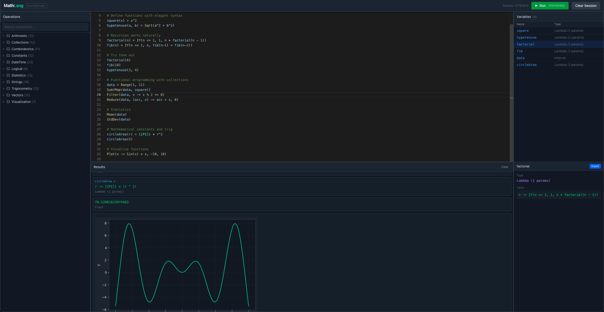

# MathLang

[](https://www.python.org/downloads/)
[](https://github.com/andrasp/math-lang/actions/workflows/ci.yml)
[](LICENSE)

A mathematical expression language with an interactive web playground, CLI, and embeddable evaluation engine.



## About

MathLang is a nostalgia project - a modern rewrite and extension of a language I originally built in 2010 using C# with a Windows desktop frontend. This version reimagines it as a Python-based evaluation engine with a web playground for experimentation and a CLI for scripting.

This isn't meant to compete with scientific computing tools like MATLAB, Julia, or Python's NumPy. It's nowhere near those. It's a purpose-built DSL that prioritizes readability, immediate feedback, and a gentle learning curve for mathematical exploration.

Sometimes the best reason to build something is just because you enjoyed building it the first time.

## What It Looks Like

```python
# Define functions naturally
quadratic(a, b, c, x) = a*x^2 + b*x + c
distance(x1, y1, x2, y2) = Sqrt((x2-x1)^2 + (y2-y1)^2)

# Recursive definitions just work
factorial(n) = If(n <= 1, 1, n * factorial(n - 1))
fib(n) = If(n <= 1, n, fib(n-1) + fib(n-2))

# Functional programming with collections
data = Range(1, 101)
squares = Map(data, x -> x^2)
evens = Filter(data, x -> x % 2 == 0)
sum_of_squares = Reduce(squares, (acc, x) -> acc + x, 0)

# Statistics on the fly
Mean(data)                    # 50.5
StdDev(data)                  # 29.01
Correlation(data, squares)    # 0.97
LinearRegression(data, Map(data, x -> 2*x + 5))  # [slope, intercept, r²]

# Visualize functions directly
Plot(x -> Sin(x) * Exp(-x/10), 0, 20)
Histogram(Map(Range(1, 1000), _ -> Random()), 20)

# Complex numbers are native
z = 3 + 4i
Abs(z)         # 5
z * (2 - 1i)   # 10 + 5i

# Named constants read like math
area = [[PI]] * r^2
golden = (1 + Sqrt(5)) / 2  # same as [[PHI]]
```

## Features

**Language**
- Variables, lambdas, and user-defined functions with natural `f(x) = expr` syntax
- Complex number support (`3+2i`, `2i`)
- Named constants: `[[PI]]`, `[[E]]`, `[[PHI]]`, `[[TAU]]`, physical constants
- Comments with `#`

**Operations** - 100+ built-in operations across:
- Arithmetic & trigonometry
- Statistics (mean, median, stddev, correlation, linear regression, percentiles)
- Combinatorics (factorial, permutations, combinations, primes, fibonacci)
- Collections (map, filter, reduce, range, list operations)
- Vectors (dot product, cross product, magnitude, normalize)
- Strings (concat, split, join, replace, formatting)
- DateTime (parsing, arithmetic, formatting)
- Visualization (2D/3D plots, histograms, scatter plots)

**Interfaces**
- Web playground with Monaco editor and server-rendered plots
- CLI for evaluation, scripts, and REPL
- REST/WebSocket API for integration

## Installation

```bash
# Core library + CLI
pip install -e .

# With API server (adds FastAPI, matplotlib for plots)
pip install -e ".[api]"

# Development (adds pytest, mypy, ruff)
pip install -e ".[dev]"
```

## Usage

### CLI

```bash
mlang eval "Sum(Map(Range(1, 11), x -> x^2))"   # Quick evaluation
mlang run script.mlang                           # Run a script file
mlang repl                                       # Interactive REPL
mlang ops                                        # List all operations
```

### Web Playground

```bash
# Start the API server
cd math-lang && uvicorn api.main:app --reload

# In another terminal, start the frontend
cd web && npm install && npm run dev
```

### As a Library

```python
from mathlang.engine import evaluate
from mathlang.engine.session import Session

session = Session()
results = evaluate("x = 10; y = 20; x + y", session)
print(results[-1].value)  # Scalar(30)

# Session preserves state
evaluate("z = x * y", session)
results = evaluate("z", session)
print(results[0].value)  # Scalar(200)
```

## Architecture

```
mathlang/
├── lang/           # Language frontend
│   ├── grammar.lark    # Lark LALR grammar
│   ├── ast.py          # AST node definitions
│   └── parser.py       # Parse tree → AST transformer
│
├── types/          # Value types
│   ├── base.py         # MathObject protocol
│   ├── scalar.py       # Numbers, booleans, strings, datetime
│   ├── vector.py       # Fixed-size numeric vectors
│   ├── collection.py   # List (eager) and Interval (lazy ranges)
│   ├── callable.py     # Lambda and Thunk (deferred evaluation)
│   └── result.py       # PlotData, Error, Notification
│
├── engine/         # Evaluation
│   ├── evaluator.py    # AST walker, operator dispatch
│   ├── session.py      # Variable scoping, parent-child sessions
│   └── errors.py       # Typed exceptions
│
└── operations/     # Extensible operation system
    ├── base.py         # Operation, OperationProvider protocols
    ├── registry.py     # Global registration, lookup by identifier
    └── providers/      # Pluggable operation modules
        ├── arithmetic.py
        ├── trigonometry.py
        ├── statistics.py
        ├── visualization.py
        └── ...
```

### Design Highlights

**Lazy evaluation where it matters.** The `Thunk` type wraps unevaluated AST nodes, enabling short-circuit evaluation in `If`/`And`/`Or` and making recursive function definitions work naturally. `Interval` generates range values on-demand rather than allocating upfront.

**Pluggable operations.** New operation categories are added by implementing `OperationProvider` and registering with the global registry. Each operation declares its metadata (name, description, arguments) for introspection and documentation generation.

**Session scoping.** Lambda evaluation creates child sessions that inherit parent bindings, providing proper lexical scoping without global state. This enables closures and nested function definitions.

**Visualization as data.** Plot operations return structured `PlotData2D`/`PlotData3D` objects rather than producing side effects. The API layer renders these server-side with matplotlib, sending base64-encoded PNGs to the frontend.

### The Grammar

The language is parsed using [Lark](https://github.com/lark-parser/lark) with an LALR(1) grammar. A few details worth noting:

**Function definitions are syntactic sugar.** The parser transforms `f(x, y) = expr` into an assignment of a lambda: `f = (x, y) -> expr`. This keeps the evaluator simple while supporting natural mathematical notation.

**Arrow tokens avoid ambiguity.** Lambda syntax (`x -> x^2`) uses `->` as a dedicated token rather than `-` followed by `>`. This sidesteps LALR conflicts with subtraction and comparison operators.

**Power is right-associative.** Unlike most operators, `^` associates to the right: `2^3^4` means `2^(3^4)`, matching standard mathematical convention.

**Complex literals in the lexer.** Expressions like `3+2i` are parsed as single tokens rather than `3 + 2*i`. This allows imaginary numbers to work without a predefined `i` constant.

### Extending with Built-in Operations

Adding new operations is straightforward. Unlike user-defined functions (which are great for script-level abstractions), built-in operations can access Python libraries, define custom argument handling, and control evaluation order.

Here's the complete implementation of the `Random` operation:

```python
self.register(Operation(
    identifier="Random",
    friendly_name="Random",
    description="Returns a random number between 0 and 1",
    category="Arithmetic/Random",
    optional_args=[
        ArgInfo("a", "Lower bound"),
        ArgInfo("b", "Upper bound"),
    ],
    execute=self._random,
))

def _random(self, args: list["MathObject"], session: "Session") -> "MathObject":
    if len(args) == 0:
        return Scalar(random.random())
    elif len(args) == 1:
        return Scalar(random.randint(0, int(args[0].value) - 1))
    else:
        return Scalar(random.uniform(args[0].value, args[1].value))
```

Operations declare their metadata upfront (name, category, arguments), which enables the playground's operations panel and `mlang ops` to generate documentation automatically.

### Type System

All values in MathLang extend the `MathObject` supertype. The type hierarchy keeps the evaluator simple - it only needs to handle a small set of concrete types:

```
MathObject
├── Scalar          # int, float, complex, bool, str, datetime
├── Vector          # fixed-size numeric array
├── List            # heterogeneous collection
├── Interval        # lazy range (start, end, step)
├── Lambda          # params + body + closure
├── Thunk           # deferred evaluation (unevaluated AST)
├── PlotData2D      # x/y values for 2D plots
├── PlotData3D      # x/y/z grid for surface plots
├── HistogramData   # values + bin count
├── ScatterData     # x/y point pairs
├── Error           # message + details
└── Notification    # info message
```

`Scalar` is the workhorse - it wraps Python's numeric types, booleans, strings, and datetimes. `Thunk` enables lazy evaluation for short-circuit logic and recursion. `Lambda` captures its defining scope for proper closures. The plot types are data containers that the API layer renders server-side. New types can be added as needed - just extend `MathObject` and implement `display()` and `type_name`.

## Development

```bash
pytest                      # Run tests
pytest --cov=mathlang       # With coverage
mypy mathlang               # Type checking
ruff check .                # Linting
```

## License

MIT
